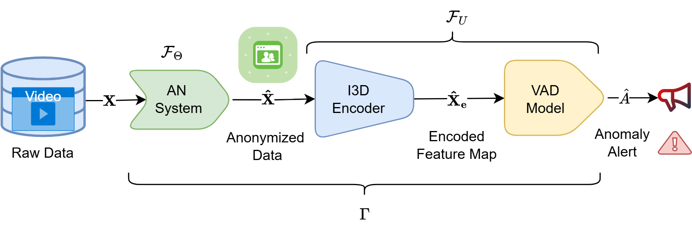
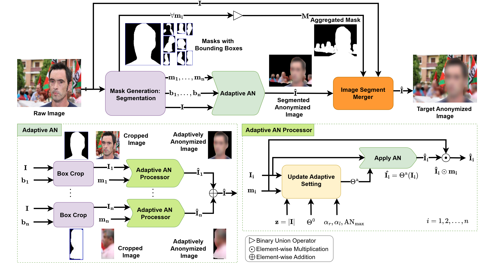
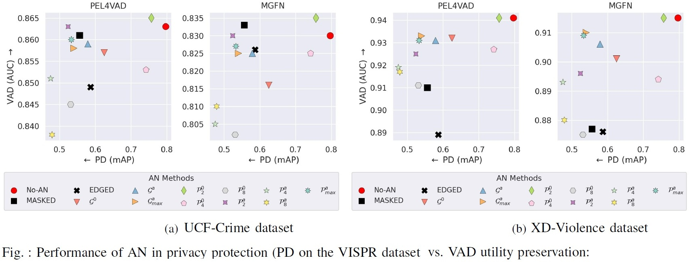
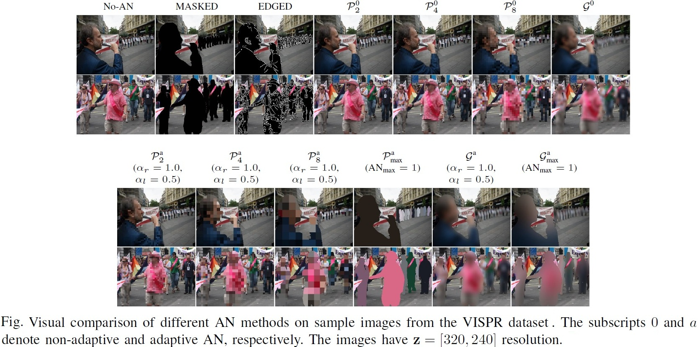
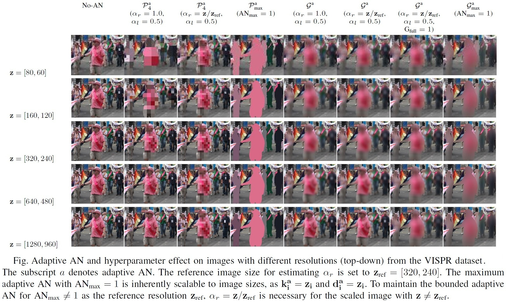
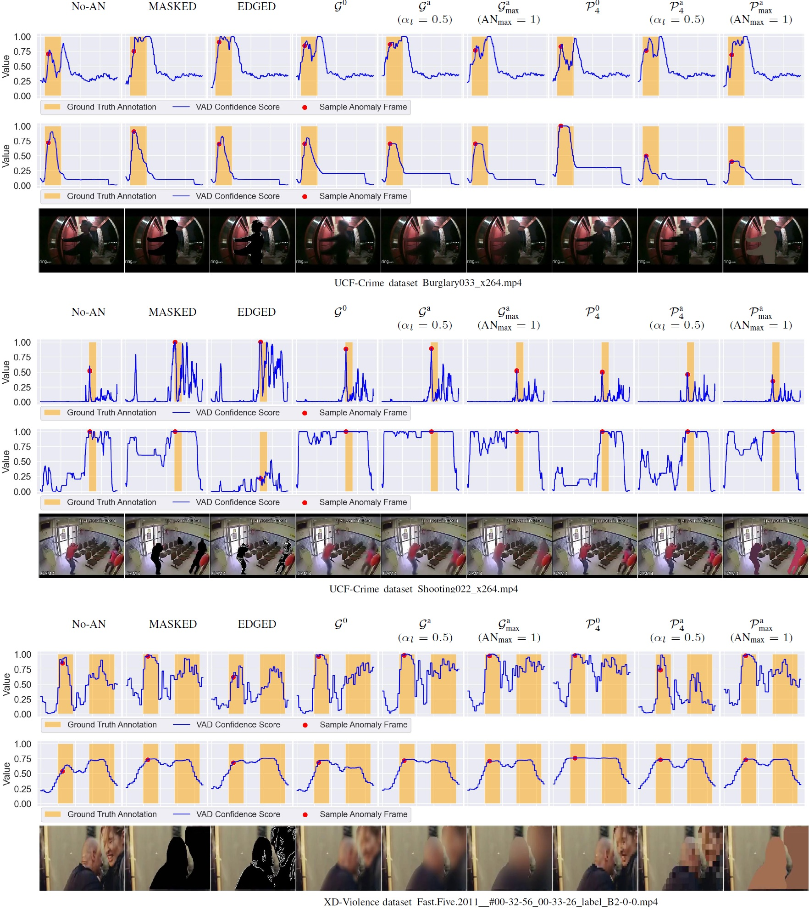
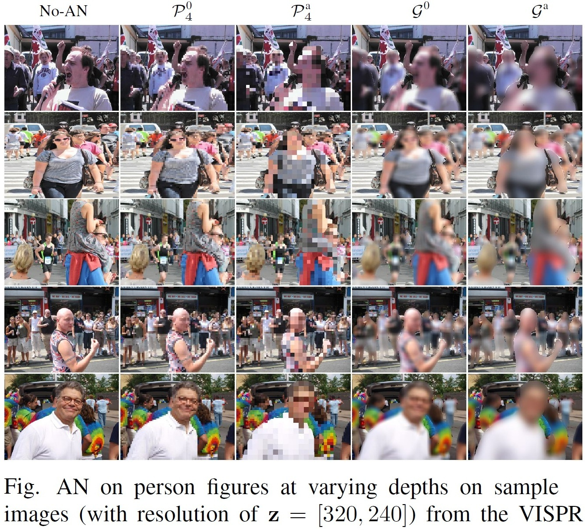
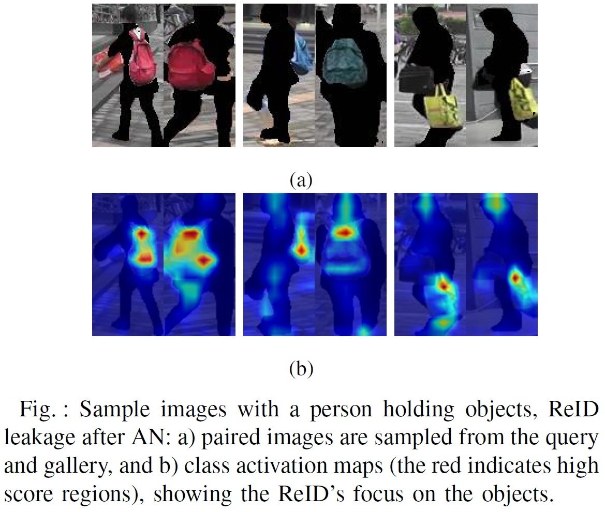

# LA3D: A Lightweight Adaptive Privacy Anonymization for Video Anomaly Detection

Official implementation of the paper "Low-Latency Video Anonymization for Crowd Anomaly Detection: Privacy vs. Performance" (full paper in [arXiv](https://arxiv.org/abs/2410.18717))

The LA3D offer computationally efficient and dynamic anonymization (AN) that enhance privacy protection while maintain the accuracy of Video Anomaly Detection (VAD). 

## Highlights (live dashboard demo at [PACA AI4citizens](https://ai4citizens.uia.no/app_dashboard))

- Recent advancements in AI hold considerable promise for enhancing computer vision (CV) applications using surveillance cameras.  

- Concerns about privacy and model bias have made it challenging to utilize CV in public. 

- Most of them of the existing AN approaches employ deep learning models that are computationally demanding for real-time edge deployment. 

- In this study, we revisit conventional AN solutions for privacy protection and real-time VAD. 

- We propose a novel LA3D that employs dynamic AN adjustment to enhance privacy-aware VAD. 

- We have evaluated the approaches on publicly available privacy-attribute and large-scale VAD data sets.

- Our experiment demonstrates that LA3D enables substantial improvement in the privacy AN capability without significantly degrading VAD efficacy.

## Resources

We thank and give credit to the public data sets and source code for VAD model provides listed below.

- Data sets
    - Privacy Data sets:
        - VISPR ([data](https://tribhuvanesh.github.io/vpa/), [paper](https://arxiv.org/abs/1703.10660))
        - Market1501 ([data](https://academictorrents.com/details/3ea1f8ae1d3155addff586a96006d122587663ee), [paper](https://ieeexplore.ieee.org/document/7410490))

    - Video Anomaly Detection:
        - UCF-Crime ([repo](https://www.crcv.ucf.edu/projects/real-world/), [paper](https://openaccess.thecvf.com/content_cvpr_2018/html/Sultani_Real-World_Anomaly_Detection_CVPR_2018_paper.html))
        - XD-Violence ([repo](https://roc-ng.github.io/XD-Violence/), [paper](https://link.springer.com/chapter/10.1007/978-3-030-58577-8_20))

- Models: 
    - PEL4VAD Weakly-Supervised VAD Model ([repo](https://github.com/yujiangpu20/PEL4VAD), [paper](https://ieeexplore.ieee.org/abstract/document/10667004))
    - MGFN Weakly-Supervised VAD Model ([repo](https://github.com/carolchenyx/MGFN.), [paper](https://ojs.aaai.org/index.php/AAAI/article/view/25112))
    - Video Encoding Model ([repo](https://github.com/google-deepmind/kinetics-i3d), [paper](https://arxiv.org/abs/1705.06950), [paper](https://arxiv.org/abs/1705.07750), [paper](https://openaccess.thecvf.com/content_cvpr_2018/html/Wang_Non-Local_Neural_Networks_CVPR_2018_paper.html))
    - ReID Model ([repo](https://github.com/KaiyangZhou/deep-person-reid), [paper](https://openaccess.thecvf.com/content_ICCV_2019/html/Zhou_Omni-Scale_Feature_Learning_for_Person_Re-Identification_ICCV_2019_paper.html))


## System Design of the LA3D  

General System Pipeline Diagram of Anonymized VAD


System Pipeline Diagram of the adaptive AN System: The adaptive AN enhances privacy protection by utilizing the dynamic AN method.


## Performance on Privacy Attribute Detection vs. Video Anomaly Detection

Using PEL4VAD and MGFN VAD Models on the UCF-Crime and XD-Violence Datasets. 

$G^0$: baseline Guassian, $G^a$: adaptive Guassian, $G^a_{max}$: adaptive maximum Guassian, $P^0$: baseline pixelization, $\mathcal{P^a}$: adaptive pixelization, and $P^a_{max}$: adaptive maximum pixelization.


<!-- START doctoc -->
**Table of Contents**
- [Installation](https://github.com/muleina/LA3D#installation)
- [Usage-CLI](https://github.com/muleina/LA3D#usage-cli)
  - [LA3D: Real-Time AN using Webcam](https://github.com/muleina/LA3D#LA3D:-Real-Time-AN-using-Webcam)
  - [LA3D: AN on Images](https://github.com/muleina/LA3D#LA3D:-AN-on-Images)
  - [LA3D: AN-VAD on Videos](https://github.com/muleina/LA3D#LA3D:-AN-VAD-on-Videos)
- [Usage-Notebook](https://github.com/muleina/LA3D#usage-notebook)
- [Examples](https://github.com/muleina/LA3D#Examples)
  - [AN Enhancement using our Adaptive Approach](https://github.com/muleina/LA3D#AN-Enhancement-using-our-Adaptive-Approach)
  - [AN Trade-offs on VAD](https://github.com/muleina/LA3D#AN-Trade-offs-on-VAD)
  - [More AN Results](https://github.com/muleina/LA3D#More-AN-Results)
- [Computational Cost Analysis](https://github.com/muleina/LA3D#Computational-Cost-Analysis)
- [Privacy-Leakage after AN](https://github.com/muleina/LA3D#Privacy-Leakage-after-AN)
- [BibTeX Citation](https://github.com/muleina/LA3D#BibTeX-Citation)

<!-- END doctoc generated TOC please keep comment here to allow auto update -->


## Installation

Download models from [Google drive](https://drive.google.com/drive/folders/1EVZFgQJKvNVhUkrcdHYb7LvMWBGCGkPv?usp=drive_link)

    # Clone the repo.
    git clone https://github.com/muleina/LA3D.git && cd LA3D

    # Download the model checkpoints from the Google drive link. 
    # Store the models in /src/models/{'MODEL NAME'}/. Keep the path structure for each model as the download repository.

        |-LA3D/
            |-src/
                |-model/
                    |-OBJECT_DETECTOR/
                        |-yolo/
                    |-VIDEO_ENCODER_RESNET_1024/
                        |-models/
                            |-i3d/
                                |-ckpt/
                    |-VIDEO_ENCODER_RESNET_2048/
                        |-ckpt/
                    |-PEL4VAD/
                        |-ckpt/
                    |-MGFN
                        |-ckpt/

    # Anaconda install options: using yml
    conda env create -f conda_environment.yml

    # Anaconda install options: using txt
    conda create --name la3d --file conda_requirements.txt

    # Pip install to existing environment.
    pip install -r pip_requirements.txt

    # The setup configurations of the LA3D are given in the config/config.py file.

## Usage-CLI

The LA3D app testing parameters can be supplied through the main.py. 

Real-time processing through webcam and offline processing from image or video files are supported.

  ### LA3D: Real-Time AN using Webcam
    python main.py -a an -if webcam -is 320 240 -anm mask -odc person -ods 320 240 -odt 0.25 -v
    python main.py -a an -if webcam -is 320 240 -anm no-an -odc person -ods 320 240 -odt 0.25 -v
    python main.py -a an -if webcam -is 320 240 -anm edge -odc person -ods 320 240 -odt 0.25 -v
    python main.py -a an -if webcam -is 320 240 -anm blur -odc person -ods 320 240 -odt 0.25 -v
    python main.py -a an -if webcam -is 320 240 -anm adaptive_blur -odc person -ods 320 240 -odt 0.25 -v
    python main.py -a an -if webcam -is 320 240 -anm adaptive_full_blur -odc person -ods 320 240 -odt 0.25 -v
    python main.py -a an -if webcam -is 320 240 -anm adaptive_max_blur -odc person -ods 320 240 -odt 0.25 -v
    python main.py -a an -if webcam -is 320 240 -anm pixelization -odc person -ods 320 240 -odt 0.25 -v
    python main.py -a an -if webcam -is 320 240 -anm adaptive_pixelization -odc person -ods 320 240 -odt 0.25 -v
    python main.py -a an -if webcam -is 320 240 -anm adaptive_max_pixelization -odc person -ods 320 240 -odt 0.25 -v
    
  ### LA3D: AN on Images
    python main.py -a an -if image -is 320 240 -id "{add here the main_path}/data/VISPR/2017_17368641.jpg" -anm no-an -odc person -ods 320 240 -odt 0.25 -v
    python main.py -a an -if image -is 320 240 -id "{add here the main_path}/data/VISPR/2017_17368641.jpg" -anm mask -odc person -ods 320 240 -odt 0.25 -s
    python main.py -a an -if image -is 320 240 -id "{add here the main_path}/data/VISPR/2017_17368641.jpg" -anm blur -odc person -ods 320 240 -odt 0.25 -s
    python main.py -a an -if image -is 320 240 -id "{add here the main_path}/data/VISPR/2017_17368641.jpg" -anm adaptive_blur -odc person -ods 320 240 -odt 0.25 -s
    python main.py -a an -if image -is 320 240 -id "{add here the main_path}/data/VISPR/2017_17368641.jpg" -anm adaptive_full_blur -odc person -ods 320 240 -odt 0.25 -s
    python main.py -a an -if image -is 320 240 -id "{add here the main_path}/data/VISPR/2017_17368641.jpg" -anm pixelization -odc person -ods 320 240 -odt 0.25 -s
    python main.py -a an -if image -is 320 240 -id "{add here the main_path}/data/VISPR/2017_17368641.jpg" -anm adaptive_pixelization -odc person -ods 320 240 -odt 0.25 -s
    
  ### LA3D: AN-VAD on Videos
    python main.py -a an-ad -adm pel -ads ucf -if video -id "{add here the main_path}/data/UCF_Crime/Burglary033_x264.mp4" -anm no-an -odc person -ods 320 240 -odt 0.25 -s
    python main.py -a an-ad -adm pel -ads ucf -if video -id "{add here the main_path}/data/UCF_Crime/Burglary033_x264.mp4" -anm mask -odc person -ods 320 240 -odt 0.25 -s
    python main.py -a an-ad -adm pel -ads ucf -if video -id "{add here the main_path}/data/UCF_Crime/Burglary033_x264.mp4" -anm blur -odc person -ods 320 240 -odt 0.25 -s
    python main.py -a an-ad -adm pel -ads ucf -if video -id "{add here the main_path}/data/UCF_Crime/Burglary033_x264.mp4" -anm adaptive_blur -odc person -ods 320 240 -odt 0.25 -s
    python main.py -a an-ad -adm pel -ads ucf -if video -id "{add here the main_path}/data/UCF_Crime/Burglary033_x264.mp4" -anm adaptive_full_blur -odc person -ods 320 240 -odt 0.25 -s
    python main.py -a an-ad -adm pel -ads ucf -if video -id "{add here the main_path}/data/UCF_Crime/Burglary033_x264.mp4" -anm pixelization -odc person -ods 320 240 -odt 0.25 -s
    python main.py -a an-ad -adm pel -ads ucf -if video -id "{add here the main_path}/data/UCF_Crime/Burglary033_x264.mp4" -anm adaptive_pixelization -odc person -ods 320 240 -odt 0.25 -s

    python main.py -a an-ad -adm pel -ads xd -if video -id "{add here the main_path}/data/XD_Violence/Fast.Five.2011__#00-32-56_00-33-26_label_B2-0-0.mp4" -anm no-an -odc person -ods 320 240 -odt 0.25 -s
    python main.py -a an-ad -adm pel -ads xd -if video -id "{add here the main_path}/data/XD_Violence/Fast.Five.2011__#00-32-56_00-33-26_label_B2-0-0.mp4" -anm mask -odc person -ods 320 240 -odt 0.25 -s
    python main.py -a an-ad -adm pel -ads xd -if video -id "{add here the main_path}/data/XD_Violence/Fast.Five.2011__#00-32-56_00-33-26_label_B2-0-0.mp4" -anm adaptive_blur -odc person -ods 320 240 -odt 0.25 -s
    python main.py -a an-ad -adm pel -ads xd -if video -id "{add here the main_path}/data/XD_Violence/Fast.Five.2011__#00-32-56_00-33-26_label_B2-0-0.mp4" -anm adaptive_full_blur -odc person -ods 320 240 -odt 0.25 -s
    python main.py -a an-ad -adm pel -ads xd -if video -id "{add here the main_path}/data/XD_Violence/Fast.Five.2011__#00-32-56_00-33-26_label_B2-0-0.mp4" -anm pixelization -odc person -ods 320 240 -odt 0.25 -s
    python main.py -a an-ad -adm pel -ads xd -if video -id "{add here the main_path}/data/XD_Violence/Fast.Five.2011__#00-32-56_00-33-26_label_B2-0-0.mp4" -anm adaptive_pixelization -odc person -ods 320 240 -odt 0.25 -s

    python main.py -a an-ad -adm mgfn -ads ucf -if video -id "{add here the main_path}/data/UCF_Crime/Burglary033_x264.mp4" -anm mask -odc person -ods 320 240 -odt 0.25 -s
    python main.py -a an-ad -adm mgfn -ads xd -if video -id "{add here the main_path}/data/XD_Violence/Fast.Five.2011__#00-32-56_00-33-26_label_B2-0-0.mp4" -anm mask -odc person -ods 320 240 -odt 0.25 -s
    
## Usage-Notebook
We have also provided a [notebook](https://github.com/muleina/LA3D/notebook/an_vad_example_1.ipynb) for step=by-step demo of the AN and VAD using different models and data sources. 

## Examples: 
### AN Enhancement using LA3D's Adaptive Approach 
Privacy protection comparison with baseline AN: 

$G^0$: baseline Guassian, $G^a$: adaptive Guassian, $P^0$: baseline pixelization, and $\mathcal{P^a}$: adaptive pixelization.


Scalability comparison on different image resolutions


### AN Trade-offs on VAD



### More AN Results: 
$No-AN$: Non-anonymized, $G^0$: baseline Guassian, $G^a$: adaptive Guassian, $P^0$: baseline pixelization, and $\mathcal{P^a}$: adaptive pixelization.



## Computational Cost Analysis

The conventional baseline vs adaptive vs deep learning AN approaches on an Intel(R) Xeon(R) Platinum 8168 CPU @ 2.70GHz with 64GB RAM and Nvidia Tesla V100-SXM3-32GB.

- The adaptive approaches of the LA3D increase the processing time by approximately 5%–6% compared to the baselines on the AN-VAD process. 

We have also conducted the cost analysis of the AN in GPU and CPU modes: 

- The adaptive AN increases the GPU processing time by $3$ to $6$ milliseconds and $1$ to $9$ milliseconds on CPU. 

- The incremental peak memory cost remains roughly $220$ MB for the GPU and $160$ MB for the CPU, with a negligible difference from the baseline ANs. 

- The DL method has a $16 \times$ slower speed and a $14 \times$  higher memory consumption. The [DeepPrivacy2](https://github.com/hukkelas/deep_privacy2), one of the state-of-the-art DL approaches in realistic image generation for AN, considerably sacrifices computation efficiency. 

- The cost analysis demonstrates the feasibility of the proposed lightweight AN approaches for real-time edge CV applications.


## Privacy-Leakage after AN

We have revealed potential privacy leakage after AN where individual person can be identified from personal belongings.




## BibTeX Citation

If you employ any part of the study or the code, please kindly cite the following paper:
```
@article{asres2024la3d,
  title={Low-Latency Video Anonymization for Crowd Anomaly Detection: Privacy vs. Performance},
  author={Asres, Mulugeta Weldezgina and Jiao, Lei and Omlin, Christian Walter},
  journal={arXiv preprint arXiv:2410.18717},
  year={2024}
}
```
<!-- END doctoc -->
