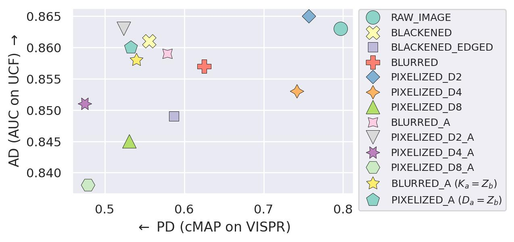
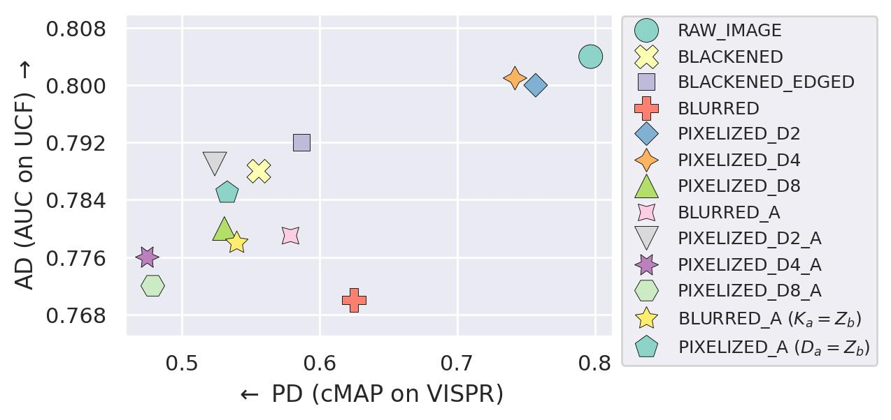
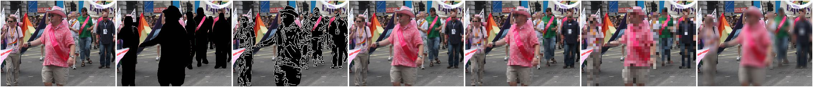
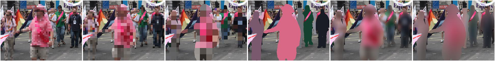
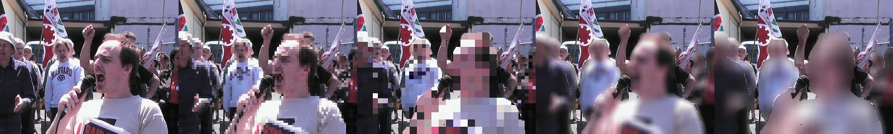
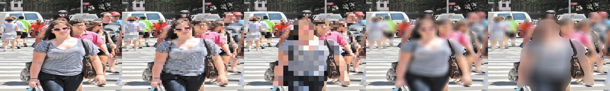
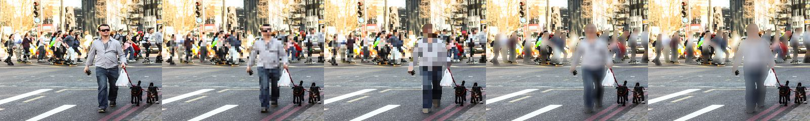
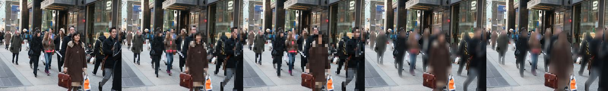

# LA3D 
A lightweight adaptive anonymization for VAD (LA3D) that employs dynamic adjustment to enhance privacy protection. 

## Abstract (You can read the full paper in [arXiv](https://arxiv.org/abs/2410.18717))
Recent advancements in artificial intelligence promise ample potential in monitoring applications with surveillance cameras.  
However, concerns about privacy and model bias have made it challenging to utilize them in public. Although de-identification approaches have been proposed in the literature, aiming to achieve a certain level of anonymization, most of them employ deep learning models that are computationally demanding for real-time edge deployment. 
In this study, we revisit conventional anonymization solutions for privacy protection and real-time video anomaly detection (VAD) applications. We propose a novel lightweight adaptive anonymization for VAD (LA3D) that employs dynamic adjustment to enhance privacy protection. 
We evaluated the approaches on publicly available privacy and VAD data sets to examine the strengths and weaknesses of the different anonymization techniques and highlight the promising efficacy of our approach. 
Our experiment demonstrates that LA3D enables substantial improvement in the privacy anonymization capability without majorly degrading VAD efficacy.

## Code is coming soon!!!

## Performance on Privacy Attribute Detection  vs. Video Anomaly Detection

### Using PEL4VAD VAD Model


### Using MGFN VAD Model



## Examples: Anonymization Enhancement using our Adaptive Approach (_A)

### 1:RAW\_IMAGE, 2:BLACKENED, 3:BLACKENED_EDGED, 4:PIXELIZED_D2, 5:PIXELIZED_D4, 6:PIXELIZED_D8, 7:BLURRED


###  8:PIXELIZED_D2_A ($\alpha_b=0.5$), 9:PIXELIZED_D4_A ($\alpha_b=0.5$), 10:PIXELIZED_D8_A ($\alpha_b=0.5$), 11:PIXELIZED_A ($ismax=True$, $D_a=Z_b$), 12:BLURRED_A ($\alpha_b=0.5$), 13:BLURRED_A ($ismax=True$, $K_a=Z_b$)


### 1: RAW_IMAGE, 2: PIXELIZED_D4, 3: PIXELIZED_D4_A, 4: BLURRED, 5: BLURRED_A







## BibTeX Citation

If you employ any part of the code, please kindly cite the following papers:
```
@article{asres2024la3d,
  title={Low-Latency Video Anonymization for Crowd Anomaly Detection: Privacy vs. Performance},
  author={Asres, Mulugeta Weldezgina and Jiao, Lei and Omlin, Christian Walter},
  journal={arXiv preprint arXiv:2410.18717},
  year={2024}
}
```
