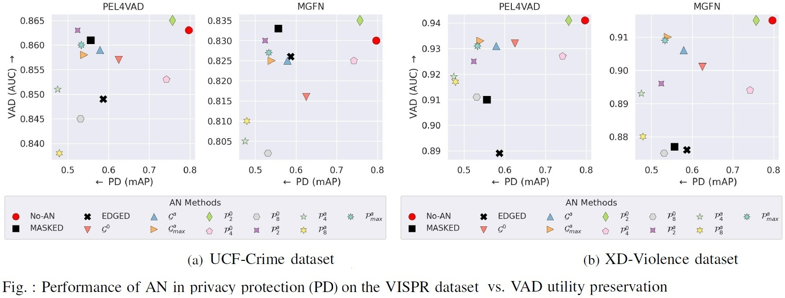

# LA3D 

A lightweight adaptive anonymization for VAD (LA3D) that employs dynamic adjustment to enhance privacy protection. 

## Summary (full paper in [arXiv](https://arxiv.org/abs/2410.18717))

Recent advancements in artificial intelligence hold considerable promise for enhancing monitoring applications using surveillance cameras.  
However, concerns about privacy and model bias have made it challenging to utilize them in public. Although de-identification approaches have been proposed in the literature, aiming to achieve a certain level of anonymization, most of them employ deep learning models that are computationally demanding for real-time edge deployment. In this study, we revisit conventional anonymization solutions for privacy protection and real-time video anomaly detection (VAD) applications. We propose a novel lightweight adaptive anonymization for VAD (LA3D) that employs dynamic adjustment to enhance privacy protection. 
We evaluated the approaches on publicly available privacy and VAD data sets to examine the strengths and weaknesses of the different anonymization techniques and highlight the promising efficacy of our strategy. 
Our experiment demonstrates that LA3D enables substantial improvement in the privacy anonymization capability without significantly degrading VAD efficacy.

## System Design of the LA3D  

General System Pipeline Diagram of Anonymized VAD


System Pipeline Diagram of the adaptive AN System: The adaptive AN enhances privacy protection by utilizing the dynamic AN method.


## Performance on Privacy Attribute Detection vs. Video Anomaly Detection

Using PEL4VAD and MGFN VAD Models on the UCF-Crime and XD-Violence Datasets. 

$G^0$: baseline Guassian, $G^a$: adaptive Guassian, $G^a_{max}$: adaptive maximum Guassian, $P^0$: baseline pixelization, $\mathcal{P^a}$: adaptive pixelization, and $P^a_{max}$: adaptive maximum pixelization.


<!-- START doctoc -->
**Table of Contents**
- [Installation](https://github.com/muleina/LA3D#installation)
- [Usage](https://github.com/muleina/LA3D#usage)
  - [LA3D: Real-Time AN using Webcam](https://github.com/muleina/LA3D#LA3D:-Real-Time-AN-using-Webcam)
  - [LA3D: AN on Images](https://github.com/muleina/LA3D#LA3D:-AN-on-Images)
  - [LA3D: AN-VAD on Videos](https://github.com/muleina/LA3D#LA3D:-AN-VAD-on-Videos)
- [Examples](https://github.com/muleina/LA3D#Examples)
  - [AN Enhancement using our Adaptive Approach](https://github.com/muleina/LA3D#AN-Enhancement-using-our-Adaptive-Approach)
  - [AN Trade-offs on VAD](https://github.com/muleina/LA3D#AN-Trade-offs-on-VAD)
  - [More AN Results](https://github.com/muleina/LA3D#More-AN-Results)
- [BibTeX Citation](https://github.com/muleina/LA3D#BibTeX-Citation)
<!-- END doctoc generated TOC please keep comment here to allow auto update -->


## Installation
    conda env create -f environment.yml

## Usage
  ### LA3D: Real-Time AN using Webcam
    python main.py -a an -if webcam -anm mask -odc person -ods 320 240 -odt 0.25 -v
    python main.py -a an -if webcam -anm no-an -odc person -ods 320 240 -odt 0.25 -v
    python main.py -a an -if webcam -anm edge -odc person -ods 320 240 -odt 0.25 -v
    python main.py -a an -if webcam -anm blur -odc person -ods 320 240 -odt 0.25 -v
    python main.py -a an -if webcam -anm adaptive_blur -odc person -ods 320 240 -odt 0.25 -v
    python main.py -a an -if webcam -anm adaptive_full_blur -odc person -ods 320 240 -odt 0.25 -v
    python main.py -a an -if webcam -anm adaptive_max_blur -odc person -ods 320 240 -odt 0.25 -v
    python main.py -a an -if webcam -anm pixelization -odc person -ods 320 240 -odt 0.25 -v
    python main.py -a an -if webcam -anm adaptive_pixelization -odc person -ods 320 240 -odt 0.25 -v
    python main.py -a an -if webcam -anm adaptive_max_pixelization -odc person -ods 320 240 -odt 0.25 -v
    
  ### LA3D: AN on Images
    python main.py -a an -if image -id "{add here the main_path}/data/VISPR/2017_17368641.jpg" -anm no-an -odc person -ods 320 240 -odt 0.25 -v
    python main.py -a an -if image -id "{add here the main_path}/data/VISPR/2017_17368641.jpg" -anm mask -odc person -ods 320 240 -odt 0.25 -s
    python main.py -a an -if image -id "{add here the main_path}/data/VISPR/2017_17368641.jpg" -anm blur -odc person -ods 320 240 -odt 0.25 -s
    python main.py -a an -if image -id "{add here the main_path}/data/VISPR/2017_17368641.jpg" -anm adaptive_blur -odc person -ods 320 240 -odt 0.25 -s
    python main.py -a an -if image -id "{add here the main_path}/data/VISPR/2017_17368641.jpg" -anm adaptive_full_blur -odc person -ods 320 240 -odt 0.25 -s
    python main.py -a an -if image -id "{add here the main_path}/data/VISPR/2017_17368641.jpg" -anm pixelization -odc person -ods 320 240 -odt 0.25 -s
    python main.py -a an -if image -id "{add here the main_path}/data/VISPR/2017_17368641.jpg" -anm adaptive_pixelization -odc person -ods 320 240 -odt 0.25 -s
    
  ### LA3D: AN-VAD on Videos
    python main.py -a an-ad -ads ucf -if video -id  "{add here the main_path}/data/UCF_Crime/Burglary033_x264.mp4" -anm no-an -odc person -ods 320 240 -odt 0.25 -s
    python main.py -a an-ad -ads ucf -if video -id  "{add here the main_path}/data/UCF_Crime/Burglary033_x264.mp4" -anm mask -odc person -ods 320 240 -odt 0.25 -s
    python main.py -a an-ad -ads ucf -if video -id  "{add here the main_path}/data/UCF_Crime/Burglary033_x264.mp4" -anm blur -odc person -ods 320 240 -odt 0.25 -s
    python main.py -a an-ad -ads ucf -if video -id  "{add here the main_path}/data/UCF_Crime/Burglary033_x264.mp4" -anm adaptive_blur -odc person -ods 320 240 -odt 0.25 -s
    python main.py -a an-ad -ads ucf -if video -id  "{add here the main_path}/data/UCF_Crime/Burglary033_x264.mp4" -anm adaptive_full_blur -odc person -ods 320 240 -odt 0.25 -s
    python main.py -a an-ad -ads ucf -if video -id  "{add here the main_path}/data/UCF_Crime/Burglary033_x264.mp4" -anm pixelization -odc person -ods 320 240 -odt 0.25 -s
    python main.py -a an-ad -ads ucf -if video -id  "{add here the main_path}/data/UCF_Crime/Burglary033_x264.mp4" -anm adaptive_pixelization -odc person -ods 320 240 -odt 0.25 -s
    

## Examples: 
### AN Enhancement using our Adaptive Approach 
Privacy protection comparison with baseline AN: 

$G^0$: baseline Guassian, $G^a$: adaptive Guassian, $P^0$: baseline pixelization, and $\mathcal{P^a}$: adaptive pixelization.


Scalability comparison on different image resolutions


### AN Trade-offs on VAD


### More AN Results: 
$G^0$: baseline Guassian, $G^a$: adaptive Guassian, $P^0$: baseline pixelization, and $\mathcal{P^a}$: adaptive pixelization.


## BibTeX Citation
If you employ any part of the study or the code, please kindly cite the following paper:
```
@article{asres2024la3d,
  title={Low-Latency Video Anonymization for Crowd Anomaly Detection: Privacy vs. Performance},
  author={Asres, Mulugeta Weldezgina and Jiao, Lei and Omlin, Christian Walter},
  journal={arXiv preprint arXiv:2410.18717},
  year={2024}
}
```
<!-- END doctoc -->
